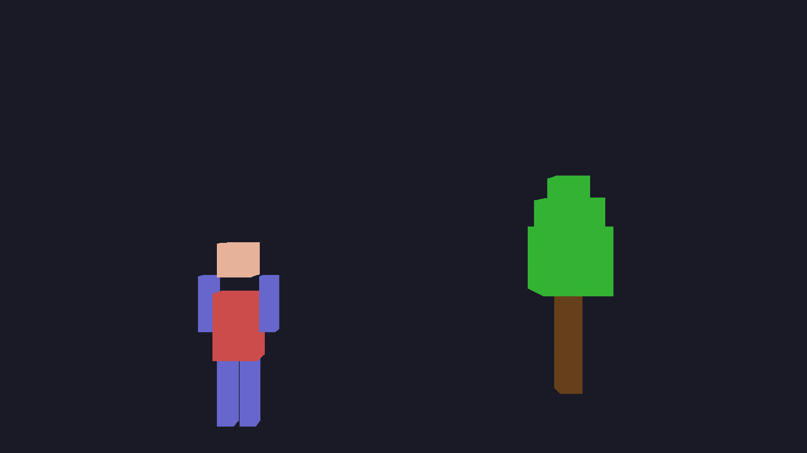
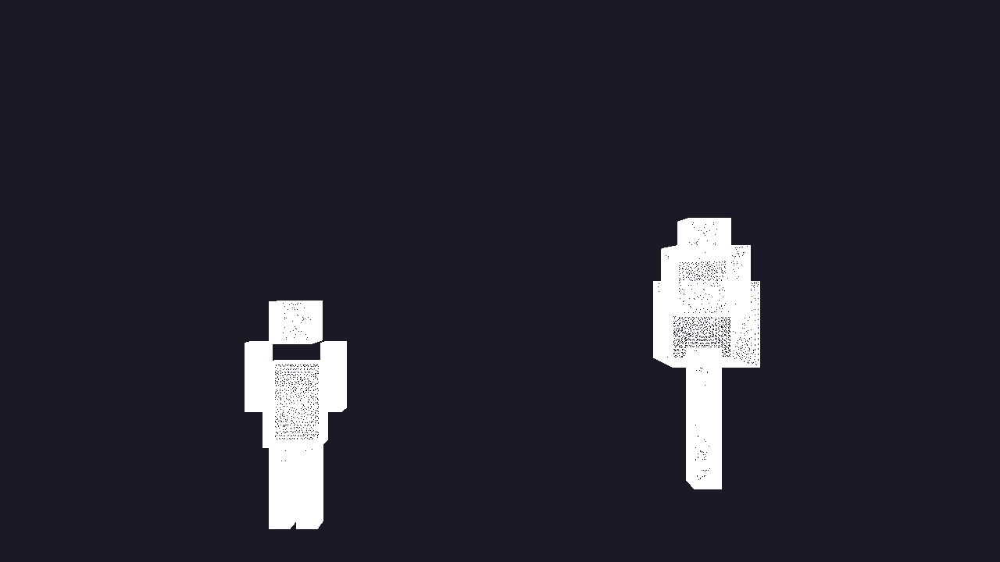

# OpenGL Tessellation Demo - C#

A cross-platform OpenGL 4.1 tessellation demo showcasing hardware-accelerated Tessellation Control Shaders (TCS) and Tessellation Evaluation Shaders (TES). The demo features a blocky humanoid and tree rendered with configurable tessellation parameters.

  

## Sample Output

| Color Mode – Tess Level 8, Triangles | Wireframe Mode – Tess Level 16, Triangles |
|:---:|:---:|
|  |  |

*Left: interpolated vertex colors showing the blocky humanoid (red torso, peach head, blue limbs) and tree (green canopy, brown trunk). Right: wireframe overlay exposing the dense triangle mesh generated by GPU tessellation at level 16.*

## Features

### Real-Time Tessellation Control
- **Three Domain Types**: Triangles, Quads, and Isolines
- **Multiple Partitioning Schemes**: Equal spacing, Fractional Even, and Fractional Odd
- **Dynamic LOD**: Real-time tessellation level adjustment (1-64)
- **Dual Render Modes**: Color-shaded and wireframe visualization

### Interactive Camera System
- **WASD Movement**: Pan through the 3D scene
- **Mouse Look**: Full 360-degree camera rotation
- **Vertical Movement**: Space (up) and Shift (down)
- **Zoom**: Mouse wheel for field-of-view adjustment

### OpenGL 4.1 Compatibility
Limited to OpenGL 4.1 features for maximum compatibility with macOS's deprecated OpenGL support via Metal translation layer.

## Architecture

### Tessellation Pipeline

The demo implements the full OpenGL tessellation pipeline:

```
Vertex Shader → Tessellation Control Shader → Tessellation Evaluation Shader → Fragment Shader
```

1. **Vertex Shader** (`Shaders/vertex.glsl`): Passes through position and color data
2. **Tessellation Control Shader** (`Shaders/tess_control*.glsl`): Controls tessellation levels per patch
3. **Tessellation Evaluation Shader** (`Shaders/tess_eval*.glsl`): Generates new vertices based on domain type
4. **Fragment Shader** (`Shaders/fragment.glsl`): Outputs final color or wireframe

### Project Structure

```
tessellation-cs/
├── TessellationDemo.sln           # Solution (main + tests)
├── TessellationDemo.csproj        # Main project configuration
├── Program.cs                     # Application entry point + CLI dispatch
├── src/
│   ├── TessellationWindow.cs      # Main window and rendering logic
│   ├── Camera.cs                  # Camera system with WASD controls
│   ├── ShaderProgram.cs           # Shader compilation and management
│   ├── Geometry.cs                # Geometry generation (humanoid + tree)
│   ├── CliOptions.cs              # CLI argument parsing
│   └── HeadlessRenderer.cs        # Offscreen rendering (--dump-image)
├── TessellationDemo.Tests/
│   ├── TessellationDemo.Tests.csproj
│   ├── CameraTests.cs             # Camera math unit tests
│   ├── GeometryTests.cs           # Geometry data unit tests
│   └── ShaderFileTests.cs         # GLSL source validation tests
├── Shaders/
│   ├── vertex.glsl                # Vertex shader
│   ├── tess_control*.glsl         # Tessellation control shaders
│   ├── tess_eval_*.glsl           # Tessellation evaluation shaders
│   └── fragment.glsl              # Fragment shader
└── docs/                          # Generated sample images
```

## Controls

### Camera Controls
| Key/Input | Action |
|-----------|--------|
| `W` | Move forward |
| `A` | Move left |
| `S` | Move backward |
| `D` | Move right |
| `Space` | Move up |
| `Left Shift` | Move down |
| `Mouse` | Look around (when captured) |
| `Mouse Wheel` | Zoom in/out |
| `ESC` | Toggle mouse capture |

### Tessellation Controls
| Key | Action |
|-----|--------|
| `1` | Switch to **Triangles** domain |
| `2` | Switch to **Quads** domain |
| `3` | Switch to **Isolines** domain |
| `Q` | **Equal spacing** partitioning |
| `E` | **Fractional Even** spacing |
| `R` | **Fractional Odd** spacing |
| `+` / `=` | Increase tessellation level |
| `-` | Decrease tessellation level |
| `M` | Toggle between **color** and **wireframe** mode |
| `H` | Toggle help text |

## Tessellation Modes Explained

### Domain Types
- **Triangles**: Input patches are triangular (3 control points). Generates triangular sub-patches.
- **Quads**: Input patches are quadrilateral (4 control points). Generates quad-based tessellation.
- **Isolines**: Generates line strips useful for terrain contours or hair rendering.

### Partitioning Schemes
- **Equal Spacing**: Divides edges into equal segments (smoothest)
- **Fractional Even**: Rounds to nearest even integer, smoother transitions
- **Fractional Odd**: Rounds to nearest odd integer, smoother transitions
- **Integer** *(pow2)*: Not implemented (would round to powers of 2)

### Render Modes
- **Color Mode**: Displays geometry with interpolated vertex colors
- **Wireframe Mode**: Shows all generated triangles/lines from tessellation

## Build Instructions

### Prerequisites

#### All Platforms
- [.NET 8.0 SDK](https://dotnet.microsoft.com/download/dotnet/8.0) or later

#### Linux
```bash
# Ubuntu/Debian
sudo apt-get install dotnet-sdk-8.0

# Fedora
sudo dnf install dotnet-sdk-8.0
```

#### macOS
```bash
# Using Homebrew
brew install --cask dotnet-sdk
```

#### Windows
Download and install the .NET 8.0 SDK from the official Microsoft website.

### Building the Project

#### Using .NET CLI (All Platforms)

```bash
# Clone or navigate to the repository
cd tessellation-cs

# Restore dependencies
dotnet restore

# Build the project
dotnet build

# Run the application
dotnet run
```

#### Building for Release

```bash
# Build optimized release version
dotnet build -c Release

# Run release version
dotnet run -c Release
```

#### Platform-Specific Builds

```bash
# Windows
dotnet publish -c Release -r win-x64 --self-contained

# Linux
dotnet publish -c Release -r linux-x64 --self-contained

# macOS
dotnet publish -c Release -r osx-x64 --self-contained
```

The published executable will be in `bin/Release/net8.0/<runtime>/publish/`

## CLI Image Dump

The `--dump-image` flag renders a single frame offscreen to a PNG file and exits, making it easy to produce screenshots in headless/CI environments without an interactive window:

```bash
# Basic color mode capture
dotnet run -- --dump-image output.png

# Wireframe at tessellation level 16, quads domain
dotnet run -- --dump-image wire.png --wireframe --tess-level 16 --domain quads

# Full options
dotnet run -- --dump-image out.png \
    --tess-level 8          \
    --domain triangles      \
    --spacing equal         \
    --width 1920 --height 1080 \
    --wireframe

# Show all options
dotnet run -- --help
```

### Headless / CI rendering (Linux)

On Linux servers without a display, use Xvfb and Mesa software rendering:

```bash
Xvfb :99 -screen 0 1280x720x24 &
DISPLAY=:99 LIBGL_ALWAYS_SOFTWARE=1 dotnet run -- --dump-image output.png --tess-level 8
```

Or with `xvfb-run`:
```bash
LIBGL_ALWAYS_SOFTWARE=1 xvfb-run -s '-screen 0 1280x720x24' \
    dotnet run -- --dump-image output.png --tess-level 8
```

## Running Tests

The solution includes a comprehensive test suite covering camera math, geometry correctness, and shader source validation — all runnable without a GPU:

```bash
# Run all tests
dotnet test

# Run with detailed output
dotnet test -v normal

# Filter to a specific class
dotnet test --filter "FullyQualifiedName~CameraTests"
```

### Test Coverage

| Test Class | Tests | What It Validates |
|------------|------:|-------------------|
| `CameraTests` | 26 | Position, vectors, pitch/FOV clamping, mouse input, view/projection matrices, orthogonality |
| `GeometryTests` | 20 | Vertex/index counts, index bounds, color ranges, finite positions, spatial layout |
| `ShaderFileTests` | 73 | File existence, `#version 410`, `main()` presence, patch sizes, uniform names, balanced braces |
| **Total** | **119** | |

Expected output:
```
Test Run Successful.
Total tests: 119
     Passed: 119
 Total time: ~1.6 Seconds
```

## System Requirements

### Minimum Requirements
- **GPU**: OpenGL 4.1 capable graphics card
- **OS**: Windows 10+, Linux (kernel 4.0+), macOS 10.15+
- **RAM**: 512 MB
- **.NET**: 8.0 or later

### Tested On
- ✅ Windows 10/11 (NVIDIA, AMD, Intel)
- ✅ Ubuntu 20.04+ (NVIDIA, AMD)
- ✅ macOS Monterey+ (Intel, M1/M2 via Rosetta)
- ✅ Linux headless with Mesa 25 (`LIBGL_ALWAYS_SOFTWARE=1`) + Xvfb

### macOS Notes
macOS deprecated OpenGL in favor of Metal. The demo uses OpenGL 4.1 (the highest version Apple supports) and works via Apple's OpenGL-to-Metal translation layer. Performance may vary on Apple Silicon Macs.

## Troubleshooting

### "OpenGL 4.1 not supported" Error
- **Solution**: Update your graphics drivers
- **macOS**: Ensure macOS 10.13+ (High Sierra or later)

### Shaders Fail to Compile
- **Check**: Ensure all `.glsl` files are in the `Shaders/` directory
- **Check**: Files are copied to output directory (should happen automatically)

### Poor Performance
- Lower tessellation level (press `-` key)
- Switch to Equal spacing mode (press `Q`)
- Ensure hardware acceleration is enabled in your OS

### Application Won't Start on Linux
```bash
# Install OpenGL/GLX libraries
sudo apt-get install libglu1-mesa libgl1-mesa-glx

# For Wayland users, try forcing X11
export GDK_BACKEND=x11
dotnet run
```

## Technical Details

### OpenGL Extensions Used
- `GL_ARB_tessellation_shader` (core in 4.0+)
- `GL_ARB_separate_shader_objects` (core in 4.1+)

### Shader Compilation
The application dynamically loads and compiles 9 shader program combinations at startup:
- 3 domain types × 3 spacing modes = 9 shader programs

Shader compilation errors are logged to the console.

### Geometry Generation
- **Humanoid**: ~144 vertices, positioned at (-1.5, 0, 0)
- **Tree**: ~96 vertices, positioned at (1.5, 0, 0)
- All geometry is generated as patch primitives (triangles)

## Dependencies

- **OpenTK 4.8.2**: OpenGL bindings for .NET — windowing, input, and math
- **SixLabors.ImageSharp**: Pure managed PNG output for `--dump-image`
- **xUnit 2.7**: Test framework for the unit and integration test suite

## License

This project is licensed under the MIT License - see the [LICENSE](LICENSE) file for details.

## Acknowledgments

- **OpenTK**: For excellent OpenGL bindings for .NET
- **Khronos Group**: For OpenGL specifications and documentation

## Further Reading

- [OpenGL Tessellation Overview](https://www.khronos.org/opengl/wiki/Tessellation)
- [OpenGL 4.1 Core Profile Specification](https://www.khronos.org/registry/OpenGL/specs/gl/glspec41.core.pdf)
- [OpenTK Documentation](https://opentk.net/learn/)

---

**Enjoy exploring hardware tessellation!**
